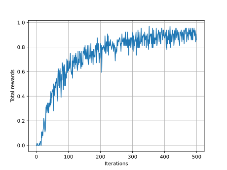

# FrozenLake-IRL

An MaxEnt IRL example developed in `Gymnasium FrozenLake-v1` environment.

## Usage

```shell
pip install -r requirements.txt
python -m scripts.train_reward
```

Then the feature weights learned save at `./theta.py`, and the reward curve will
be displayed on the screen.


